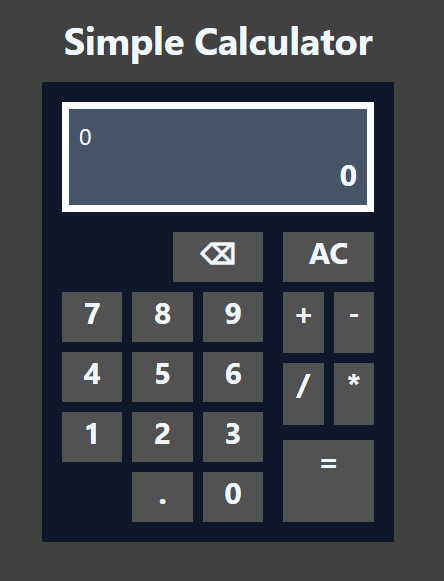

# Calculator App

A sleek and functional calculator application built with **React**, **TypeScript**, and **TailwindCSS**. This app provides basic arithmetic operations with a user-friendly interface.

## Features

- Addition, subtraction, multiplication, and division operations.
- Responsive design, optimized for both desktop and mobile devices.
- Clean and modern UI styled with TailwindCSS.
- Built with TypeScript for type safety and maintainability.

## Tech Stack

- **React**: Frontend library for building the user interface.
- **TypeScript**: Ensures type safety and better developer experience.
- **TailwindCSS**: Utility-first CSS framework for styling.

## Installation and Setup

1. **Clone the repository**:
   ```bash
   git clone https://github.com/Ganesh-Ghadage/Simple-Calculator.git
   cd calculator-app
   ```

2. **Install dependencies**:
   ```bash
   npm install
   ```

3. **Run the development server**:
   ```bash
   npm run dev
   ```

4. Open your browser and navigate to `http://localhost:5173` (or the URL shown in the terminal).

## Scripts

- **Start Development Server**: `npm run dev`
- **Build for Production**: `npm run build`
- **Preview Production Build**: `npm run preview`

## File Structure

```plaintext
calculator-app/
├── src/
│   ├── components/
│   │   └── Calculator        // Calculator components
│   ├── index.css             // TailwindCSS styles
│   ├── App.tsx               // Main app component
│   ├── main.tsx              // Entry point
│   └── ...                   // Additional files
├── index.html                // HTML template
├── package.json              // Project metadata and scripts
├── tailwind.config.js        // TailwindCSS configuration
├── tsconfig.json             // TypeScript configuration
└── vite.config.ts            // Vite configuration
```

## Customization

You can customize the calculator's styles by modifying the TailwindCSS classes in the `src/components/` directory or updating the `tailwind.config.js` file.

## Screenshots




## Contribution

Contributions are welcome! Feel free to open an issue or submit a pull request.

1. Fork the repository.
2. Create your feature branch: `git checkout -b feature/your-feature`.
3. Commit your changes: `git commit -m 'Add some feature'`.
4. Push to the branch: `git push origin feature/your-feature`.
5. Open a pull request.

---

Made with ❤️ using React, TypeScript, and TailwindCSS.
